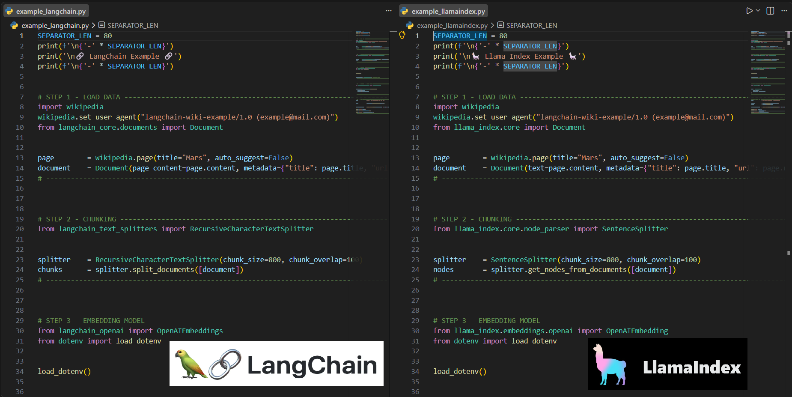

# rag-under-the-hood

[](https://github.com/sponsors/hasff)
[](https://hasff.github.io/my-ai-portfolio/)

> A practical, side by side comparison of the basic RAG building blocks (chunking, embeddings, vector store, retrieval) implemented with 🔗 LangChain and with 🦙 LlamaIndex.

> 💾 If this project looks useful, starring it now means you won't lose it later.

🗓️ **Status: August 2026**

---

## Picture this

You're curious about RAG, and you want the smallest possible example to see it work end to end.

So you grab a Wikipedia page about Mars, split it into chunks, embed it, index it, and ask a simple question like *"What is the atmosphere of Mars made of?"*.

Two popular frameworks, 🔗 LangChain and 🦙 LlamaIndex, let you build exactly that. So you try it with one, then do the exact same thing again with the other, and compare what comes back.

That's this whole project: same data, same question, two frameworks, side by side.

⚖️ This is also a companion piece to my [legal-doc-rag-summarizer](https://github.com/hasff/legal-doc-rag-summarizer) project, where every RAG step (chunking, embeddings, vector search, BM25, hybrid retrieval) is built manually, from scratch. Here, the same steps are handed off to 🔗 LangChain and 🦙 LlamaIndex, so you can see what a framework does for you versus what you'd otherwise build yourself.



*A quick look at both scripts answering the same question about Mars.*

---

⚠️ **Heads up**

This is a personal learning project, not an official resource.
It may contain errors, simplifications, or opinionated choices made for clarity over correctness.

Before you dive in, keep a few things in mind:
1. The AI/RAG landscape moves fast; library and API names may change.
2. Not production ready code. Built to learn and to teach.
3. This README was written with AI assistance, mainly for text refinement. The architecture, code, and technical decisions are my own.

---

## Key Concepts Demonstrated

✅ Data loading (Wikipedia)
<br>✅ Text chunking
<br>✅ Embeddings with OpenAI
<br>✅ In memory vector store
<br>✅ Query and similarity search
<br>✅ Direct comparison between both frameworks - 🔗 LangChain vs 🦙 LlamaIndex

<a name="table-of-contents_"></a>

---

## Table of Contents

- [Purpose](#purpose_)
- [Project Architecture](#project-architecture_)
- [Requirements](#requirements_)
- [Setup](#setup_)
- [Project Structure](#project-structure_)
- [`example_langchain.py`](#example-langchain_)
- [`example_llamaindex.py`](#example-llamaindex_)
- [LangChain vs LlamaIndex comparison](#langchain-vs-llamaindex_)
- [Conclusions](#conclusions_)
- [Next Steps & Resources](#next-steps--resources_)
- [Get in Touch](#get-in-touch_)

<a name="purpose_"></a>

---

## Purpose

#### ⚡ Quick Navigation: [⬅️ Table of Contents](#table-of-contents_) | [Project Architecture ➡️](#project-architecture_)

This is a simple example, not a full framework tutorial. The goal is narrow on purpose: run the same five step RAG flow (load, chunk, embed, store, query) once in 🔗 LangChain and once in 🦙 LlamaIndex, using the same data source and the same question, and let the code speak for itself.
 
It's a companion piece to [legal-doc-rag-summarizer](https://github.com/hasff/legal-doc-rag-summarizer), where every RAG step is built manually, from scratch. Here, those same steps are handed off to a framework, so you can compare "build it yourself" against "let the framework do it" and see where each library's abstractions actually help.


[↑ Back to Table of Contents](#table-of-contents_)

<a name="project-architecture_"></a>

---

## Project Architecture

#### ⚡ Quick Navigation: [⬅️ Purpose](#purpose_) | [Requirements ➡️](#requirements_)

Both scripts follow the exact same five step flow. Only the library changes.

1. Load: fetch a Wikipedia page (`Mars`) via `wikipedia`.
2. Chunk: split the text (`chunk_size=800`, `chunk_overlap=100`).
3. Embed: generate embeddings with OpenAI.
4. Store: save into an in memory vector store.
5. Query: run the same question against both systems and compare the results.

[↑ Back to Table of Contents](#table-of-contents_)

<a name="requirements_"></a>

---

## Requirements

#### ⚡ Quick Navigation: [⬅️ Project Architecture](#project-architecture_) | [Setup ➡️](#setup_)

What you need before running the scripts.

* Python 3.10+
* OpenAI API key → [platform.openai.com](https://platform.openai.com/home)

[↑ Back to Table of Contents](#table-of-contents_)

<a name="setup_"></a>

---

## Setup

#### ⚡ Quick Navigation: [⬅️ Requirements](#requirements_) | [Project Structure ➡️](#project-structure_)


You can run this project with either `Option A: pip` or `Option B: uv`. Pick whichever you're comfortable with, the two paths below are independent, follow only one.

### 1. Clone the repository

```bash
git clone https://github.com/hasff/rag-under-the-hood.git
cd rag-under-the-hood
```

---

### Option A: pip

#### 2. Create a virtual environment

```bash
# Windows
py -m venv venv

# macOS / Linux
python -m venv venv
```

```bash
# Windows
venv\Scripts\activate

# macOS / Linux
source venv/bin/activate
```

#### 3. Install dependencies

```bash
pip install -r requirements.txt
```

#### 4. Configure environment variables

```bash
cp .env.example .env
```

Add your OpenAI API key to `.env`:

```
OPENAI_API_KEY="your_key_here"
```

> ⚠️ Never commit your .env file. Add it to .gitignore.

---

### Option B: uv

#### 2. Install uv

```bash
# Windows (PowerShell)
powershell -ExecutionPolicy ByPass -c "irm https://astral.sh/uv/install.ps1 | iex"

# macOS / Linux
curl -LsSf https://astral.sh/uv/install.sh | sh
```

#### 3. Sync dependencies

```bash
uv sync
```

This creates a virtual environment and installs everything from `pyproject.toml` / `uv.lock`. No manual `venv` step needed.

#### 4. Configure environment variables

```bash
cp .env.example .env
```

Add your OpenAI API key to `.env`:

```
OPENAI_API_KEY="your_key_here"
```

> ⚠️ Never commit your .env file. Add it to .gitignore.

#### 5. Run scripts with uv

```bash
uv run example_langchain.py
```

`uv run` auto syncs dependencies before executing, so you don't need to activate anything manually.


[↑ Back to Table of Contents](#table-of-contents_)

<a name="project-structure_"></a>

---

## Project structure

#### ⚡ Quick Navigation: [⬅️ Setup](#setup_) | [`example_langchain.py` ➡️](#example-langchain_)

```
rag-under-the-hood/
├── .env.example
├── .gitignore
├── .python-version
├── LICENSE
├── README.md
├── pyproject.toml
├── uv.lock
├── requirements.txt
├── example_langchain.py
└── example_llamaindex.py
```

Two files: `example_langchain.py` and `example_llamaindex.py` run the exact same RAG flow so you can compare them side by side.

[↑ Back to Table of Contents](#table-of-contents_)

<a name="example-langchain_"></a>

---

## `example_langchain.py`

#### ⚡ Quick Navigation: [⬅️ Project structure](#project-structure_) | [`example_llamaindex.py` ➡️](#example-llamaindex_)

### Steps covered:
1. [Load data (`Document`, `wikipedia`)](#step-1-code-langchain_)<br>
2. [Chunking (`RecursiveCharacterTextSplitter`)](#step-2-code-langchain_)<br>
3. [Embedding model (`OpenAIEmbeddings`)](#step-3-code-langchain_)<br>
4. [In memory vector store (`InMemoryVectorStore`)](#step-4-code-langchain_)<br>
5. [Query (`similarity_search`)](#step-5-code-langchain_)

<a name="step-1-code-langchain_"></a>

---


### 🔗 Step 1 - Load Data

📒 We load a Wikipedia page (Mars) and wrap it in a `Document` object, the standard entry point LangChain uses for any RAG pipeline.

> 🦙 Compare with [LlamaIndex Step 1](#step-1-code-llamaindex_)
>
> ⚖️ Manual equivalent: [legal-doc-rag-summarizer, Part 01](https://github.com/hasff/legal-doc-rag-summarizer#part-1)


```python
# STEP 1 - LOAD DATA ----------------------------------------------------------------------------
import wikipedia
wikipedia.set_user_agent("langchain-wiki-example/1.0 (example@mail.com)")
from langchain_core.documents import Document


page        = wikipedia.page(title="Mars", auto_suggest=False)
document    = Document(page_content=page.content, metadata={"title": page.title, "url": page.url})
```

- `import wikipedia` brings in the library that makes the request to Wikipedia. 

- `wikipedia.set_user_agent` identifies the script to the Wikipedia API, good practice to avoid getting blocked. 

- `Document` comes from `langchain_core.documents`, the class LangChain uses to represent any unit of content throughout the pipeline.

- `page = wikipedia.page(title="Mars", auto_suggest=False)` fetches the page with the exact title "Mars". `auto_suggest=False` makes sure no automatic title correction happens, which could otherwise return a different page than intended.

- `document = Document(page_content=page.content, metadata={...})` wraps the page text (`page_content`) together with metadata (`title`, `url`). This metadata travels with the document and, later, with every chunk generated from it.

<br>

> ⚖️ **legal-doc-rag-summarizer** works with uploaded PDF files rather than a Wikipedia page, so `extract_text_from_pdf` plays the role `wikipedia.page()` plays here. The manual project even needs `pdfplumber` to pull raw text out of a binary file, a concern that simply does not exist when the source is already plain text coming from an API.

<a name="step-2-code-langchain_"></a>

---

### 🔗 Step 2 - Chunking

📒 We split the full page text into smaller, overlapping pieces using LangChain's native `RecursiveCharacterTextSplitter`.

> 🦙 Compare with [LlamaIndex Step 2](#step-2-code-llamaindex_)
>
> ⚖️ Manual equivalent: [legal-doc-rag-summarizer, Part 02](https://github.com/hasff/legal-doc-rag-summarizer#part-2)

```python
# STEP 2 - CHUNKING ------------------------------------------------------------------------------
from langchain_text_splitters import RecursiveCharacterTextSplitter


splitter    = RecursiveCharacterTextSplitter(chunk_size=800, chunk_overlap=100)
chunks      = splitter.split_documents([document])
```

- `RecursiveCharacterTextSplitter` comes from `langchain_text_splitters`. It is a character based splitter, not a sentence based one.

- `splitter = RecursiveCharacterTextSplitter(chunk_size=800, chunk_overlap=100)` sets the size of each chunk (800 characters) and the overlap between consecutive chunks (100 characters), the same overlap logic used in the manual `legal-doc-rag-summarizer` project.

- `chunks = splitter.split_documents([document])` takes a list of `Document` objects and returns a list of smaller `Document` objects, each one already carrying the original document's metadata (`title`, `url`) copied automatically.

<br>

> ⚖️ **legal-doc-rag-summarizer** dedicates its entire Part 02 to chunking on its own. It shows what goes wrong with naive, non overlapping chunks (a sentence split mid way, a subject losing its meaning), then builds up to overlap as the fix. It also compares four chunking strategies, size based, word based, sentence based, and structure based, with a table of pros and cons for each. It is not a production grade implementation, and it does not need to be: its value is showing, up close, the exact pains that `RecursiveCharacterTextSplitter` quietly handles for you here. Worth a read if you want to feel those pains once, before letting the framework abstract them away.

<a name="step-3-code-langchain_"></a>

---

### 🔗 Step 3 - Embedding Model

📒 We set up the OpenAI embedding model, responsible for turning each chunk into a vector.

> 🦙 Compare with [LlamaIndex Step 3](#step-3-code-llamaindex_)
>
> ⚖️ Manual equivalent: [legal-doc-rag-summarizer, Part 03](https://github.com/hasff/legal-doc-rag-summarizer#part-3)

```python
# STEP 3 - EMBEDDING MODEL -----------------------------------------------------------------------
from langchain_openai import OpenAIEmbeddings
from dotenv import load_dotenv


load_dotenv()


embeddings_model = OpenAIEmbeddings()
```

- `OpenAIEmbeddings` comes from `langchain_openai`. 

- `load_dotenv` comes from `python dotenv`, `load_dotenv()` reads the `.env` file and exposes `OPENAI_API_KEY` to the process.

- `embeddings_model = OpenAIEmbeddings()` creates the instance that will generate the vectors, using OpenAI's default embedding model. This is the same step that, in the manual project, was done for free with a local HuggingFace model. Here, the framework hides that same step behind a different class name, but the underlying tradeoff (free and local versus paid and remote) does not go away.

<br>

> ⚖️ **legal-doc-rag-summarizer** loads its embedding model the exact same way, one line, before any chunk gets touched:
>
> - `embeddings_model = SentenceTransformer('all-MiniLM-L6-v2')`, a free, local model instead of a paid API call
> - The tradeoff is real, not just theoretical: local means no per request cost and no network dependency, but also a smaller, more general purpose model than what OpenAI serves

<a name="step-4-code-langchain_"></a>

---

### 🔗 Step 4 - In Memory Vector Store

📒 We store the chunks and their vectors in an in memory vector store, ready to be searched.

> 🦙 Compare with [LlamaIndex Step 4](#step-4-code-llamaindex_)
>
> ⚖️ Manual equivalent: [legal-doc-rag-summarizer, Part 03](https://github.com/hasff/legal-doc-rag-summarizer#part-3)

```python
# STEP 4 - EMBEDDING + In Memory Store ------------------------------------------------------------
from langchain_core.vectorstores import InMemoryVectorStore


vector_store = InMemoryVectorStore.from_documents(
    documents= chunks,
    embedding= embeddings_model
)
```

- `InMemoryVectorStore` comes from `langchain_core.vectorstores`.

- `InMemoryVectorStore.from_documents(documents=chunks, embedding=embeddings_model)` is a class method that does everything in one step: 
    1) it embeds every chunk with `embeddings_model` and 
    2) stores the result (text, vector and metadata) in an index kept in memory. 

    ⚠️ There is no separate "generate embeddings" step followed by "store them"; LangChain merges both into one idiomatic call.

<br>

> ⚖️ **legal-doc-rag-summarizer** shows the embedding step out in the open, `InMemoryVectorStore.from_documents` hides it. In Part 03 you can see:
>
> - `embed_texts(chunks)`, the exact call `InMemoryVectorStore.from_documents` makes internally but never exposes, in LangChain it stays invisible, in `legal-doc-rag-summarizer` it is a visible function you call yourself, chunks in, vectors out
> - No vector store behind those vectors, just a plain Python list, kept in memory alongside the chunks it belongs to
> - No smarter indexing either, searching that list later means comparing the query against every single vector by hand, `InMemoryVectorStore` almost certainly does something less naive under the hood


<a name="step-5-code-langchain_"></a>

---

### 🔗 Step 5 - Query

📒 We ask the vector store the same question and look at which chunks come back.

> 🦙 Compare with [LlamaIndex Step 5](#step-5-code-llamaindex_)
>
> ⚖️ Manual equivalent: [legal-doc-rag-summarizer, Part 03](https://github.com/hasff/legal-doc-rag-summarizer#part-3)

```python
# STEP 5 - QUERY DATA ----------------------------------------------------------------------------
query                   = "What is the atmosphere of Mars made of?"

result                  = vector_store.similarity_search(query, k= 5)


query_related_chunks    = "\n\n---\n\n".join([doc.page_content for doc in result])

print(f'Query: {query}')
print(f'\n{'-' * SEPARATOR_LEN}\n')
print(f'Result: \n{query_related_chunks}')
```

- `query` is the plain text question.

- `vector_store.similarity_search(query, k=5)` embeds the query internally and returns the 5 `Document` objects (chunks) with the highest similarity. All the query embedding and similarity comparison work stays hidden inside this single method.

- `query_related_chunks = "\n\n---\n\n".join([doc.page_content for doc in result])` joins the text (`doc.page_content`) of every returned chunk, separated by `---`, for readable printing.

<br>

> ⚖️ **legal-doc-rag-summarizer** never merges query embedding and searching into one call the way `similarity_search` does. Part 03 keeps `embed_query` and `vector_search` as two separate, visible steps. In legal-doc-rag-summarizer you can see:
>
> - `embed_query(query)` converting the question into a vector, then `vector_search` comparing it against every chunk by hand, the two things `similarity_search` bundles into a single line in LangChain
> - Vector search alone is not the final word there, Part 04 adds BM25 keyword search on top, and Part 05 merges both rankings with Reciprocal Rank Fusion, a hybrid retrieval step `similarity_search` does not attempt, since it relies on embeddings alone
> - That same retrieval setup carried into a real app in Part 08, chunks, embeddings and the BM25 index are computed once and cached in Streamlit's session state, so every query afterwards reuses them instead of recomputing from scratch


<a name="run-it-langchain_"></a>

---

### Run it

> Compare with [🦙 LlamaIndex Run It](#run-it-llamaindex_)

**Option A: pip**

```bash
py example_langchain.py         # Windows
python example_langchain.py     # macOS / Linux
```

**Option B: uv**

```bash
uv run example_langchain.py
```

**Output**

```bash
--------------------------------------------------------------------------------

🔗 LangChain Example 🔗

--------------------------------------------------------------------------------
Query: What is the atmosphere of Mars made of?

--------------------------------------------------------------------------------

Result: 
The atmosphere of Mars consists of about 96% carbon dioxide, 1.93% argon and 1.89% nitrogen along with traces of oxygen and water. The atmosphere is quite dusty, containing particulates about 1.5 μm in diameter which give the Martian sky a tawny color when seen from the surface. It may take on a pink hue due to iron oxide particles suspended in it.

---

Mars lost its magnetosphere 4 billion years ago, possibly because of numerous asteroid strikes, so the solar wind interacts directly with the Martian ionosphere, lowering the atmospheric density by stripping away atoms from the outer layer. Both Mars Global Surveyor and Mars Express have detected ionized atmospheric particles trailing off into space behind Mars, and this atmospheric loss is being studied by the MAVEN orbiter. Compared to Earth, the atmosphere of Mars is quite rarefied. Atmospheric pressure on the surface today ranges from a low of 30 Pa (0.0044 psi) on Olympus Mons to over 1,155 Pa (0.1675 psi) in Hellas Planitia, with a mean pressure at the surface level of 600 Pa (0.087 psi). The highest atmospheric density on Mars is equal to that found 35 kilometres (22 mi) above

---

Mars is a terrestrial planet with a surface that consists of minerals containing silicon and oxygen, metals, and other elements that typically make up rock. The Martian surface is primarily composed of tholeiitic basalt, although parts are more silica-rich than typical basalt and may be similar to andesitic rocks on Earth, or silica glass. Regions of low albedo suggest concentrations of plagioclase feldspar, with northern low albedo regions displaying higher than normal concentrations of sheet silicates and high-silicon glass. Parts of the southern highlands include detectable amounts of high-calcium pyroxenes. Localized concentrations of hematite and olivine have been found. Much of the surface is deeply covered by finely grained iron(III) oxide dust.

---

Mars is the fourth planet from the Sun. It is also known as the "Red Planet", for its orange-red appearance. Mars is a desert-like rocky planet with a tenuous atmosphere that is primarily carbon dioxide (CO2). At the average surface level the atmospheric pressure is a few thousandths of Earth's, atmospheric temperature ranges from −153 to 20 °C (−243 to 68 °F), and cosmic radiation is high. Mars retains some water, in the ground as well as thinly in the atmosphere, forming cirrus clouds, fog, frost, larger polar regions of permafrost and ice caps (with seasonal CO2 snow), but no bodies of liquid surface water. Its surface gravity is roughly a third of Earth's or double that of the Moon. Its mean diameter, 6,779 km (4,212 mi), is about half the Earth's, or twice the Moon's, and its surface

---

The environmental conditions on Mars are a challenge to sustaining organic life: the planet has little heat transfer across its surface, it has poor insulation against bombardment by the solar wind due to the absence of a magnetosphere and has insufficient atmospheric pressure to retain water in a liquid form (water instead sublimes to a gaseous state). Mars is nearly, or perhaps totally, geologically dead; the end of volcanic activity has apparently stopped the recycling of chemicals and minerals between the surface and interior of the planet.
```

[↑ Back to Table of Contents](#table-of-contents_)

<a name="example-llamaindex_"></a>

---

## `example_llamaindex.py`

#### ⚡ Quick Navigation: [⬅️ `example_langchain.py`](#example-langchain_) | [LangChain vs LlamaIndex comparison ➡️](#langchain-vs-llamaindex_)

### Steps covered:
1. [Load data (`Document`, `wikipedia`)](#step-1-code-llamaindex_)<br>
2. [Chunking (`SentenceSplitter`)](#step-2-code-llamaindex_)<br>
3. [Embedding model (`OpenAIEmbeddings`)](#step-3-code-llamaindex_)<br>
4. [In memory index (`VectorStoreIndex`)](#step-4-code-llamaindex_)<br>
5. [Query (`as_retriever` + `retrieve`)](#step-5-code-llamaindex_)

<a name="step-1-code-llamaindex_"></a>

---

### 🦙 Step 1 - Load Data

📒 We load the same Wikipedia page (Mars) and wrap it in a `Document` object, now using LlamaIndex's own class.

> 🔗 Compare with [LlamaIndex Step 1](#step-1-code-langchain_)

```python
# STEP 1 - LOAD DATA ----------------------------------------------------------------------------
import wikipedia
wikipedia.set_user_agent("langchain-wiki-example/1.0 (example@mail.com)")
from llama_index.core import Document
 
 
page        = wikipedia.page(title="Mars", auto_suggest=False)
document    = Document(text=page.content, metadata={"title": page.title, "url": page.url})
```

- `import wikipedia` and `set_user_agent` are exactly the same as in the LangChain example, the only difference in this import section is where `Document` comes from, here `llama_index.core`.

- `page = wikipedia.page(title="Mars", auto_suggest=False)` is identical to the LangChain example, same page, same `auto_suggest=False`.

- `document = Document(text=page.content, metadata={...})` wraps the text and metadata the same conceptual way, but the text parameter is called `text` instead of `page_content`. Same idea, different naming between libraries.

<br>

> ⚖️ Same manual counterpart as [🔗 LangChain Step 1](#step-1-code-langchain_), see there for the `legal-doc-rag-summarizer` comparison.

<a name="step-2-code-llamaindex_"></a>

---

### 🦙 Step 2 - Chunking

📒 We split the text into nodes using LlamaIndex's native `SentenceSplitter`, which respects sentence boundaries instead of cutting at a fixed character count.

> 🔗 Compare with [LangChain Step 2](#step-2-code-langchain_)

```python
# STEP 2 - CHUNKING ------------------------------------------------------------------------------
from llama_index.core.node_parser import SentenceSplitter
 
 
splitter    = SentenceSplitter(chunk_size=800, chunk_overlap=100)
nodes       = splitter.get_nodes_from_documents([document])
```

- `SentenceSplitter` comes from `llama_index.core.node_parser`. Unlike LangChain's `RecursiveCharacterTextSplitter`, this splitter divides by sentence, always trying to end a chunk at a valid sentence boundary. <br> ⚠️ Its default splitting regex already accounts for Chinese and Japanese sentence-ending punctuation (`。？！`) alongside the Latin ones, so those two are not a blind spot. Thai is a different story: it traditionally has no punctuation marking the end of a sentence at all, so a punctuation-based splitter like this one has no reliable signal to work with there, the same caveat already covered in the sentence-based row of the chunking strategies table in `legal-doc-rag-summarizer`.

- `splitter = SentenceSplitter(chunk_size=800, chunk_overlap=100)` reuses the same numbers as the LangChain example, (🚨**ATENTION THIS ONE IS TRICKY**🚨), but here `chunk_size` and `chunk_overlap` are counted in tokens, not characters, and definitely not sentences either, even though the class name `SentenceSplitter`  might suggest otherwise. LlamaIndex's `SentenceSplitter` uses a tokenizer internally (by default a GPT2 style tokenizer) to measure each split. This makes the "800" here a very different quantity from the "800" in the LangChain example: 800 tokens is typically well over 3000 characters of English text, not 800 characters. On top of that, the splitter also prefers not to cut a sentence midway, which pushes the actual chunk boundaries around even more. Same numbers on the page, different unit entirely.


- `nodes = splitter.get_nodes_from_documents([document])` returns a list of nodes, LlamaIndex's term for what LangChain calls chunks (`Document` objects).

<br>

> ⚖️ Same manual counterpart as [🔗 LangChain Step 2](#step-2-code-langchain_), see there for the `legal-doc-rag-summarizer` comparison. The sentence based row in that project's chunking strategies table applies here even more directly than it did for the character based splitter.


<a name="step-3-code-llamaindex_"></a>

---

### 🦙 Step 3 - Embedding Model

📒 We set up the OpenAI embedding model, now using LlamaIndex's own class.

> 🔗 Compare with [LangChain Step 3](#step-3-code-langchain_)

```python
# STEP 3 - EMBEDDING MODEL -----------------------------------------------------------------------
from llama_index.embeddings.openai import OpenAIEmbedding
from dotenv import load_dotenv
 
 
load_dotenv()
 
 
embeddings_model = OpenAIEmbedding()
```

- `OpenAIEmbedding` comes from `llama_index.embeddings.openai`. Note the singular name, unlike the plural `OpenAIEmbeddings` used in the LangChain example, even though both do the same job.

- `load_dotenv()` is identical to the LangChain example, it reads `.env` and exposes `OPENAI_API_KEY`.

- `embeddings_model = OpenAIEmbedding()` creates the default instance of the embedding model, the functional equivalent of Step 3 in LangChain.

<br>

> ⚖️ Same manual counterpart as [🔗 LangChain Step 3](#step-3-code-langchain_), see there for the `legal-doc-rag-summarizer` comparison, the same local versus paid tradeoff applies here.


<a name="step-4-code-llamaindex_"></a>

---

### 🦙 Step 4 - In Memory Index

📒 We build the in memory vector index from the nodes, a single step that both embeds and stores at once.

> 🔗 Compare with [LangChain Step 4](#step-4-code-langchain_)

```python
# STEP 4 - EMBEDDING + In Memory Store ------------------------------------------------------------
from llama_index.core import VectorStoreIndex
 
 
index = VectorStoreIndex(
    nodes= nodes,
    embed_model= embeddings_model
)
```

- `VectorStoreIndex` comes from `llama_index.core`.

- `VectorStoreIndex(nodes=nodes, embed_model=embeddings_model)` is the direct equivalent of LangChain's `InMemoryVectorStore.from_documents(...)`: it takes the nodes (LlamaIndex's name for what LangChain calls chunks), embeds each one with `embeddings_model`, and stores everything in an in memory index. The naming changes (🦙`index` instead of 🔗`vector_store`), but the role in the pipeline is the same.

<br>

> ⚖️ Same manual counterpart as [🔗 LangChain Step 4](#step-4-code-langchain_), see there for the `legal-doc-rag-summarizer` comparison, the embedding step stays just as hidden here as it does in LangChain.


<a name="step-5-code-llamaindex_"></a>

---

### 🦙 Step 5 - Query

📒 We ask the index the same question, through a retriever, and compare the nodes that come back.

> 🔗 Compare with [LangChain Step 5](#step-5-code-langchain_)

```python
# STEP 5 - QUERY DATA ----------------------------------------------------------------------------
query                   = "What is the atmosphere of Mars made of?"
 
retriever               = index.as_retriever(similarity_top_k=5)
result                  = retriever.retrieve(query)
 
query_related_chunks    = "\n\n---\n\n".join([node.get_content() for node in result])
 
print(f'Query: {query}')
print(f'\n{"-" * SEPARATOR_LEN}\n')
print(f'Result: \n{query_related_chunks}')
```

- `query` is the same plain text question used in the LangChain example.

- `retriever = index.as_retriever(similarity_top_k=5)` is an explicit step LangChain does not separate out: here we first build a retriever from the index, setting `similarity_top_k=5` for how many results we want. In LangChain this step stays hidden inside `similarity_search`.

- `result = retriever.retrieve(query)` embeds the query internally and returns the 5 most relevant nodes.

- `query_related_chunks = "\n\n---\n\n".join([node.get_content() for node in result])` extracts the text of every node with `get_content()` and joins the results with `---`, the same printing pattern used in the LangChain example.

<br>

> ⚖️ Same manual counterpart as [🔗 LangChain Step 5](#step-5-code-langchain_), see there for the full `legal-doc-rag-summarizer` comparison (BM25, hybrid retrieval, Streamlit caching). One detail worth calling out here specifically: splitting `as_retriever()` from `retrieve(query)` mirrors the manual project's own separation between `embed_query` and `vector_search`, two distinct steps, closer to that structure than LangChain's single `similarity_search` call.


<a name="run-it-llamaindex_"></a>

---

### Run it

> Compare with [🔗 LangChain Run It](#run-it-langchain_)

**Option A: pip**

```bash
py example_llamaindex.py        # Windows
python example_llamaindex.py    # macOS / Linux
```

**Option B: uv**

```bash
uv run example_llamaindex.py
```

**Output**

```bash
--------------------------------------------------------------------------------

🦙 Llama Index Example 🦙

--------------------------------------------------------------------------------
Query: What is the atmosphere of Mars made of?

--------------------------------------------------------------------------------

Result: 
=== Other features ===


== Atmosphere ==

Mars lost its magnetosphere 4 billion years ago, possibly because of numerous asteroid strikes, so the solar wind interacts directly with the Martian ionosphere, lowering the atmospheric density by stripping away atoms from the outer layer. Both Mars Global Surveyor and Mars Express have detected ionized atmospheric particles trailing off into space behind Mars, and this atmospheric loss is being studied by the MAVEN orbiter. Compared to Earth, the atmosphere of Mars is quite rarefied. Atmospheric pressure on the surface today ranges from a low of 30 Pa (0.0044 psi) on Olympus Mons to over 1,155 Pa (0.1675 psi) in Hellas Planitia, with a mean pressure at the surface level of 600 Pa (0.087 psi). The highest atmospheric density on Mars is equal to that found 35 kilometres (22 mi) above Earth's surface. The resulting mean surface pressure is only 0.6% of Earth's 101.3 kPa (14.69 psi). The scale height of the atmosphere is about 10.8 kilometres (6.7 mi), which is higher than Earth's 6 kilometres (3.7 mi), because the surface gravity of Mars is only about 38% of Earth's.
The atmosphere of Mars consists of about 96% carbon dioxide, 1.93% argon and 1.89% nitrogen along with traces of oxygen and water. The atmosphere is quite dusty, containing particulates about 1.5 μm in diameter which give the Martian sky a tawny color when seen from the surface. It may take on a pink hue due to iron oxide particles suspended in it.

Despite repeated detections of methane on Mars, there is no scientific consensus as to its origin. One suggestion is that methane exists on Mars and that its concentration fluctuates seasonally. The existence of methane could be produced by non-biological process such as serpentinization involving water, carbon dioxide, and the mineral olivine, which is known to be common on Mars, or by Martian life.
Compared to Earth, its higher concentration of atmospheric CO2 and lower surface pressure may be why sound is attenuated more on Mars, where natural sources are rare apart from the wind. Using acoustic recordings collected by the Perseverance rover, researchers concluded that the speed of sound there is approximately 240 m/s for frequencies below 240 Hz, and 250 m/s for those above.
Auroras have been detected on Mars. Because Mars lacks a global magnetic field, the types and distribution of auroras there differ from those on Earth; rather than being mostly restricted to polar regions as is the case on Earth, a Martian aurora can encompass the planet. In September 2017, NASA reported radiation levels on the surface of the planet Mars were temporarily doubled, and were associated with an aurora 25 times brighter than any observed earlier, due to a massive, and unexpected, solar storm in the middle of the month.

---

=== Surface geology ===

Mars is a terrestrial planet with a surface that consists of minerals containing silicon and oxygen, metals, and other elements that typically make up rock. The Martian surface is primarily composed of tholeiitic basalt, although parts are more silica-rich than typical basalt and may be similar to andesitic rocks on Earth, or silica glass. Regions of low albedo suggest concentrations of plagioclase feldspar, with northern low albedo regions displaying higher than normal concentrations of sheet silicates and high-silicon glass. Parts of the southern highlands include detectable amounts of high-calcium pyroxenes. Localized concentrations of hematite and olivine have been found. Much of the surface is deeply covered by finely grained iron(III) oxide dust.
The Phoenix lander returned data showing Martian soil to be slightly alkaline and containing elements such as magnesium, sodium, potassium and chlorine. These nutrients are found in soils on Earth, and are necessary for plant growth. Experiments performed by the lander showed that the Martian soil has a basic pH of 7.7, and contains 0.6% perchlorate by weight, concentrations that are toxic to humans.
Streaks are common across Mars and new ones appear frequently on steep slopes of craters, troughs, and valleys. The streaks are dark at first and get lighter with age. The streaks can start in a tiny area, then spread out for hundreds of metres. They have been seen to follow the edges of boulders and other obstacles in their path. The commonly accepted hypotheses include that they are dark underlying layers of soil revealed after avalanches of bright dust or dust devils. Several other explanations have been put forward, including those that involve water or even the growth of organisms.
Environmental radiation levels on the surface are on average 0.64 millisieverts of radiation per day, and significantly less than the radiation of 1.84 millisieverts per day or 22 millirads per day during the flight to and from Mars. For comparison the radiation levels in low Earth orbit, where Earth's space stations orbit, are around 0.5 millisieverts of radiation per day. Hellas Planitia has the lowest surface radiation at about 0.342 millisieverts per day, featuring lava tubes southwest of Hadriacus Mons with potentially levels as low as 0.064 millisieverts per day, comparable to radiation levels during flights on Earth.


=== Magnetic characteristics ===

Although Mars has no evidence of a structured global magnetic field, observations show that parts of the planet's crust have been magnetized, suggesting that alternating polarity reversals of its dipole field have occurred in the past. This paleomagnetism of magnetically susceptible minerals is similar to the alternating bands found on Earth's ocean floors. One hypothesis, published in 1999 and re-examined in October 2005 (with the help of the Mars Global Surveyor), is that these bands suggest plate tectonic activity on Mars four billion years ago, before the planetary dynamo ceased to function and the planet's magnetic field faded.

---

=== Internal structure ===

Like Earth, Mars is differentiated into a dense metallic core overlaid by less dense rocky layers. The outermost layer is the crust, which is on average about 42–56 kilometres (26–35 mi) thick, with a minimum thickness of 6 kilometres (3.7 mi) in Isidis Planitia, and a maximum thickness of 117 kilometres (73 mi) in the southern Tharsis plateau. For comparison, Earth's crust averages 27.3 ± 4.8 km in thickness. The most abundant elements in the Martian crust are silicon, oxygen, iron, magnesium, aluminum, calcium, and potassium. Mars is confirmed to be seismically active; in 2019, it was reported that InSight had detected and recorded over 450 marsquakes and related events.
Beneath the crust is a silicate mantle responsible for many of the tectonic and volcanic features on the planet's surface. The upper Martian mantle is a low-velocity zone, where the velocity of seismic waves is lower than surrounding depth intervals. The mantle appears to be rigid down to the depth of about 250 km, giving Mars a very thick lithosphere compared to Earth. Below this the mantle gradually becomes more ductile, and the seismic wave velocity starts to grow again. The Martian mantle does not appear to have a thermally insulating layer analogous to Earth's lower mantle; instead, below 1050 km in depth, it becomes mineralogically similar to Earth's transition zone. At the bottom of the mantle lies a basal liquid silicate layer approximately 150–180 km thick. The Martian mantle appears to be highly heterogenous, with dense fragments up to 4 km across, likely injected deep into the planet by colossal impacts ~4.5 billion years ago; high-frequency waves from eight marsquakes slowed as they passed these localized regions, and modeling indicates the heterogeneities are compositionally distinct debris preserved because Mars lacks plate tectonics and has a sluggishly convecting interior that prevents complete homogenization.
Mars's iron and nickel core is at least partially molten, and may have a solid inner core. It is around half of Mars's radius, approximately 1650–1675 km, and is enriched in light elements such as sulfur, oxygen, carbon, and hydrogen. The temperature of the core is estimated to be 2000–2400 K, compared to 5400–6230 K for Earth's solid inner core. Whether or not a solid inner core is present inside Mars remains a topic of active research; a 2023 study using data from the InSight lander suggested the absence of a solid inner core, however a 2025 study based on the same data reported the detection of a solid inner core 613 kilometres (381 mi) ± 67 kilometres (42 mi) in radius.

---

== Habitability and habitation ==

During the late 19th century, it was widely accepted in the astronomical community that Mars had life-supporting qualities, including the presence of oxygen and water. However, in 1894 W. W. Campbell at Lick Observatory observed the planet and found that "if water vapor or oxygen occur in the atmosphere of Mars it is in quantities too small to have been detected by spectroscopes then available". That observation contradicted many of the measurements of the time and was not widely accepted. Campbell and V. M. Slipher repeated the study in 1909 using better instruments, but with the same results. It was not until the findings were confirmed by W. S. Adams in 1925 that the myth of the Earth-like habitability of Mars was finally broken. However, even in the 1960s, articles were published on Martian biology, putting aside explanations other than life for the seasonal changes on Mars.
The current understanding of planetary habitability – the ability of a world to develop environmental conditions favorable to the emergence of life – favors planets that have liquid water on their surface. Most often this requires the orbit of a planet to lie within the habitable zone, which for the Sun is estimated to extend from within the orbit of Earth to about that of Mars. During perihelion, Mars dips inside this region, but Mars's thin (low-pressure) atmosphere prevents liquid water from existing over large regions for extended periods. The past flow of liquid water demonstrates the planet's potential for habitability. Recent evidence has suggested that any water on the Martian surface may have been too salty and acidic to support regular terrestrial life.
The environmental conditions on Mars are a challenge to sustaining organic life: the planet has little heat transfer across its surface, it has poor insulation against bombardment by the solar wind due to the absence of a magnetosphere and has insufficient atmospheric pressure to retain water in a liquid form (water instead sublimes to a gaseous state). Mars is nearly, or perhaps totally, geologically dead; the end of volcanic activity has apparently stopped the recycling of chemicals and minerals between the surface and interior of the planet.
Evidence suggests that the planet was once significantly more habitable than it is today, but whether living organisms ever existed there remains unknown. The Viking probes of the mid-1970s carried experiments designed to detect microorganisms in Martian soil at their respective landing sites and had positive results, including a temporary increase in CO2 production on exposure to water and nutrients. This sign of life was later disputed by scientists, resulting in a continuing debate, with NASA scientist Gilbert Levin asserting that Viking may have found life. A 2014 analysis of Martian meteorite EETA79001 found chlorate, perchlorate, and nitrate ions in sufficiently high concentrations to suggest that they are widespread on Mars. UV and X-ray radiation would turn chlorate and perchlorate ions into other, highly reactive oxychlorines, indicating that any organic molecules would have to be buried under the surface to survive.
Small quantities of methane and formaldehyde detected by Mars orbiters are both claimed to be possible evidence for life, as these chemical compounds would quickly break down in the Martian atmosphere. Alternatively, these compounds may instead be replenished by volcanic or other geological means, such as serpentinite. Impact glass, formed by the impact of meteors, which on Earth can preserve signs of life, has also been found on the surface of the impact craters on Mars. Likewise, the glass in impact craters on Mars could have preserved signs of life, if life existed at the site.

---

Mars is the fourth planet from the Sun. It is also known as the "Red Planet", for its orange-red appearance. Mars is a desert-like rocky planet with a tenuous atmosphere that is primarily carbon dioxide (CO2). At the average surface level the atmospheric pressure is a few thousandths of Earth's, atmospheric temperature ranges from −153 to 20 °C (−243 to 68 °F), and cosmic radiation is high. Mars retains some water, in the ground as well as thinly in the atmosphere, forming cirrus clouds, fog, frost, larger polar regions of permafrost and ice caps (with seasonal CO2 snow), but no bodies of liquid surface water. Its surface gravity is roughly a third of Earth's or double that of the Moon. Its mean diameter, 6,779 km (4,212 mi), is about half the Earth's, or twice the Moon's, and its surface area is the size of all the dry land of Earth.
Fine dust is prevalent across the surface and the atmosphere, being picked up and spread at the low Martian gravity even by the weak wind of the tenuous atmosphere.
The terrain of Mars roughly follows a north–south divide, the Martian dichotomy, with the northern hemisphere mainly consisting of relatively flat, low lying plains, and the southern hemisphere of cratered highlands. Geologically, the planet is fairly active with marsquakes trembling underneath the ground, but also hosts many enormous volcanoes that are extinct (the tallest is Olympus Mons, 21.9 km or 13.6 mi tall), as well as one of the largest canyons in the Solar System (Valles Marineris, 4,000 km or 2,500 mi long). Mars has two natural satellites that are small and irregular in shape: Phobos and Deimos. With a significant axial tilt of 25 degrees, Mars experiences seasons, like Earth (which has an axial tilt of 23.5 degrees). A Martian solar year is equal to 1.88 Earth years (687 Earth days), a Martian solar day (sol) is equal to 24.6 hours.
Mars formed along with the other planets approximately 4.5 billion years ago. During the martian Noachian period (4.5 to 3.5 billion years ago), its surface was marked by meteor impacts, valley formation, erosion, the possible presence of water oceans and the loss of its magnetosphere. The Hesperian period (beginning 3.5 billion years ago and ending 3.3–2.9 billion years ago) was dominated by widespread volcanic activity and flooding that carved immense outflow channels. The Amazonian period, which continues to the present, is the currently dominating and remaining influence on geological processes. Because of Mars's geological history, the possibility of past or present life on Mars remains an area of active scientific investigation, with some possible traces needing further examination.
Being visible with the naked eye in Earth's sky as a red wandering star, Mars has been observed throughout history, acquiring diverse associations in different cultures. In 1963 the first flight to Mars took place with Mars 1, but communication was lost en route. The first successful flyby exploration of Mars was conducted in 1965 with Mariner 4. In 1971 Mariner 9 entered orbit around Mars, being the first spacecraft to orbit any body other than the Moon, Sun or Earth; following in the same year were the first uncontrolled impact (Mars 2) and first successful landing (Mars 3) on Mars. Probes have been active on Mars continuously since 1997.
```

[↑ Back to Table of Contents](#table-of-contents_)

<a name="langchain-vs-llamaindex_"></a>

---

## LangChain vs LlamaIndex comparison

#### ⚡ Quick Navigation: [⬅️ `example_llamaindex.py`](#example-llamaindex_) | [Conclusions ➡️](#conclusions_)

Walking through the same five steps twice, once per framework, surfaces more differences than a side by side read of the code suggests. This section pulls those differences together. First the chunking mismatch that turned out to matter more than a quick look implies, then a broader table covering imports, storage and naming, and finally a closer look at naming clarity itself, the one dimension where the two frameworks diverged the most.

<br>

💡 **Note on chunking**

The examples use different chunking strategies by default, and the difference goes deeper than it looks on the page. 🦙 LlamaIndex's `SentenceSplitter` measures `chunk_size` and `chunk_overlap` in tokens, and prefers not to cut a sentence midway. 🔗 LangChain's `RecursiveCharacterTextSplitter` measures both in characters. So the same number, `800`, means two very different things: roughly 800 characters on the 🔗 LangChain side, and roughly 800 tokens (well over 3000 characters of English text) on the 🦙 LlamaIndex side. This unit mismatch, not the sentence boundary preference, is the main reason 🦙 LlamaIndex chunks come out noticeably larger.

Each library was kept with its own default rather than trying to force one to imitate the other.

Chunking was not the only place the two frameworks diverged. The table below lays out the rest, side by side.

| | 🔗 LangChain | 🦙 LlamaIndex |
|---|---|---|
| Default chunking | By character | By sentence |
| `chunk_size` unit | Characters | Tokens |
| Import namespace | Scattered across separate top level packages (`langchain_core`, `langchain_text_splitters`, `langchain_openai`) | Consolidated under one top level package (`llama_index.*`) |
| Vector store | `InMemoryVectorStore` | `VectorStoreIndex` |
| Query API | `similarity_search` | `as_retriever().retrieve()` |
| Naming clarity (1 to 5, 5 = most self explanatory) | 5 | 3 |


> 💡 **Naming clarity, step by step**
>
> | Step | 🔗 LangChain | Score | 🦙 LlamaIndex | Score |
> |---|---|---|---|---|
> | Chunking | `RecursiveCharacterTextSplitter` (tells exactly what it does), `split_documents` (again no doubt about what it will do)  | 5 | `SentenceSplitter` (misleadingly suggests sentence count), `get_nodes_from_documents` (the intention here is not clear, we just know it gets something from the documents) | 2 |
> | Vector store | `InMemoryVectorStore` (we know it's a vector store in memory) | 5 | `VectorStoreIndex` (name does not reveal in memory default nor the swappable backend) | 3 |
> | Query | `similarity_search` (straight to the point) | 5 | `as_retriever()`, `retriever.retrieve()` (an extra, less obvious step) | 3 |
>
> This is a subjective read, shaped by which vocabulary already feels familiar to a given developer, not an objective ranking of the frameworks. It is also a small sample, three steps from one toy script, not a full audit of either framework's API surface.
>
> Still, it is tempting to read a pattern into it. 🔗 LangChain, at least here, feels designed more from the user's perspective: it abstracts its internals and lets you work at a higher level. 🦙 LlamaIndex, at least here, feels designed more from the perspective of its own architecture, exposing more of what is happening underneath.

[↑ Back to Table of Contents](#table-of-contents_)

<a name="conclusions_"></a>

---

## Conclusions

#### ⚡ Quick Navigation: [⬅️ LangChain vs LlamaIndex comparison](#langchain-vs-llamaindex_) | [Next Steps & Resources ➡️](#next-steps--resources_)

This project was kept intentionally simple on purpose. The goal was never to build a sophisticated RAG pipeline, or to conclude that 🔗 LangChain is better than 🦙 LlamaIndex, or vice versa. The intent was to serve two purposes: map cleanly against the manual implementation in `legal-doc-rag-summarizer`, and put 🔗 LangChain and 🦙 LlamaIndex side by side on the same task.

That is the real takeaway here. Frameworks like 🔗 LangChain and 🦙 LlamaIndex exist to abstract away the plumbing we built by hand in `legal-doc-rag-summarizer`: chunking loops, embedding calls, cosine similarity, BM25 indexing, rank fusion, and managing the vector store itself. With a framework, similarity search is just a method call, `.similarity_search()` or `.as_retriever()`, no manual cosine math, no in memory list of vectors to manage by hand. Worth remembering: cosine similarity, the approach used in `legal-doc-rag-summarizer`, is just one option among several, dot product and Euclidean distance are common alternatives, and different vector stores support different choices. Once you have built that plumbing yourself even once, using a framework stops feeling like magic and starts feeling like a shortcut you understand.

That is the value of doing both. Building it manually first teaches you what the framework is actually doing under the hood. Using the framework afterward teaches you what you gain by not doing it yourself every time: less boilerplate, sane defaults, and a common vocabulary shared across the RAG ecosystem.

Neither approach is "better" in isolation, at least not for a project this small. For pure text RAG the two are close enough that the choice barely matters, but 🦙 LlamaIndex does carry more built in structure for multimodal retrieval, images especially, worth knowing if your next project moves past plain text.

<br>

Zooming out, the real contrast isn't 🔗 LangChain versus 🦙LlamaIndex, it's framework versus manual, the approach used in my [legal-doc-rag-summarizer](https://github.com/hasff/legal-doc-rag-summarizer) project.

| | ⚖️ Manual implementation | Framework (🔗 LangChain / 🦙 LlamaIndex) |
|---|---|---|
| Control | Full, every step is explicit | Abstracted behind the API |
| Learning value | High, forces you to understand each piece | Lower, unless you dig into the internals |
| Speed to build | Slower | Faster |
| Maintenance | You own every bug | Framework absorbs common bugs, adds its own surface area |
| Best for | Learning, highly custom pipelines | Production speed, standard RAG patterns |

<br>

On 🔗 LangChain versus 🦙 LlamaIndex specifically, the previous section already covers the practical differences (chunking strategy, embedding store setup, retrieval API). There is no need to repeat that comparison here. The point of this conclusion is the broader one: know how RAG works underneath, then pick whichever framework, or no framework at all, fits the job in front of you.


[↑ Back to Table of Contents](#table-of-contents_)

<a name="next-steps--resources_"></a>

---

## Next Steps & Resources

#### ⚡ Quick Navigation: [⬅️ Conclusions](#conclusions_) | [Get in Touch ➡️](#get-in-touch_)

This project served its purpose: understand what 🔗 LangChain and 🦙 LlamaIndex are actually doing before moving on to more advanced RAG work.

A few ways to take `rag-under-the-hood` further, if you want to keep experimenting before moving on:

- **Swap Wikipedia for PDFs.** Point both loaders at real legal documents, ideally the same ones used in `legal-doc-rag-summarizer`, and compare retrieval quality side by side against the manual hybrid pipeline.
- **Try a different embedding model.** Both examples use OpenAI embeddings here. Swapping in a local `sentence-transformers` model, the same one used in `legal-doc-rag-summarizer`, would make the two projects even more directly comparable.
- **Add BM25 or hybrid retrieval to the frameworks.** Both 🔗 LangChain and 🦙 LlamaIndex support hybrid search through specific retrievers or vector store integrations. Wiring that up here would close the loop with Part 04 and Part 05 of `legal-doc-rag-summarizer`.

<br>

**LangChain and LlamaIndex**
- 🔗 [LangChain Documentation](https://python.langchain.com/)
- 🦙 [LlamaIndex Documentation](https://docs.llamaindex.ai/)

<br>

**DeepLearning\.AI course**

For a deeper dive, DeepLearning\.AI's [Retrieval Augmented Generation (RAG)](https://www.deeplearning.ai/courses/retrieval-augmented-generation) course covers vector databases, hybrid search, and production RAG in more depth than this project. I haven't taken it yet, but it's on my list for sure.

<br>

**Want to keep going?**

This project is a companion to [legal-doc-rag-summarizer](https://github.com/hasff/legal-doc-rag-summarizer), where the same RAG concepts are built entirely by hand, no frameworks involved.


[↑ Back to Table of Contents](#table-of-contents_)

<a name="get-in-touch_"></a>

---

## 📬 Get in Touch

#### ⚡ Quick Navigation: [⬅️ Next Steps & Resources](#next-steps--resources_) | [⬆️ Back to Top](#rag-under-the-hood)


This tutorial took real time, real focus, and more debugging sessions than I'd like to admit. Not because I had to build it, but because this is genuinely how I like to spend my time: learning something properly enough to explain it to someone else.

I’ve always enjoyed breaking down complex ideas into simple terms. Over time, and after hearing from so many people that my explanations click for them, I’ve come to think it might actually be a strength of mine.

Right now this is something I do on my own time, for free. But I'd genuinely love for this to become my actual work, building, teaching, and explaining things like RAG pipelines and agentic systems, not just a side project squeezed into evenings and weekends. If you're building something in this space and looking for someone who already does this kind of work without being asked, that's exactly the kind of opportunity I'm looking for.

Found this useful? Have questions or ideas? I'd love to hear from you either way.

- 🔗 **[LinkedIn](https://www.linkedin.com/in/hugo-ferro-1434b414/)**
- 📩 **Email:** hugoferro (at) gmail.com
- 🗂️ **Portfolio:** [more AI/ML projects like this one](https://hasff.github.io/my-ai-portfolio/)

[↑ Back to Table of Contents](#table-of-contents_)


---